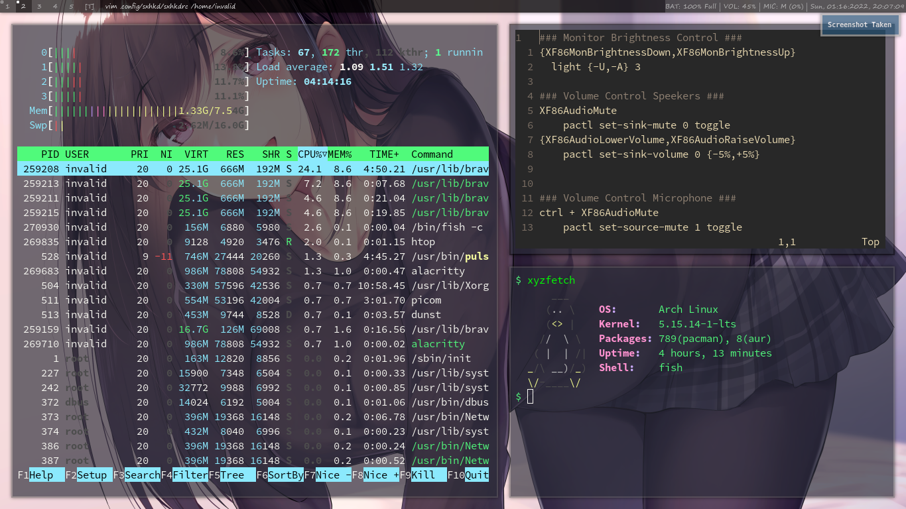

### Dotfiles
Dot file for my arch dwm config.

### Preview 

### *config file inside [root](root/) directory is for root user and [home](home/) is for regular user.*

### Config files included of:
- [alacritty](https://archlinux.org/packages/community/x86_64/alacritty/)
- [fish](https://archlinux.org/packages/community/x86_64/fish/)
- [light](https://archlinux.org/packages/community/x86_64/light/)
- [mousepad](https://archlinux.org/packages/extra/x86_64/mousepad/)
- [nitrogen](https://archlinux.org/packages/extra/x86_64/nitrogen/)
- [sxhkd](https://archlinux.org/packages/community/x86_64/sxhkd/)
- [ytfzf](https://aur.archlinux.org/packages/ytfzf/)
- [zathura](https://archlinux.org/packages/community/x86_64/zathura/)
- [vim](https://archlinux.org/packages/extra/x86_64/vim/)
- bashrc and more

Checkout My wallpapers [here 👈](https://github.com/whoisYoges/lwalpapers)

Checkout My dwm bar script [here 👈](https://github.com/whoisYoges/dwm-bar)

Checkout My minimialistic system information viewer script [here 👈](https://github.com/whoisYoges/xyzfetch)(Replacement for neofetch or rxfetch)

Checkout My wallpaper downloading Script [here 👈](https://github.com/whoisYoges/dwd)
